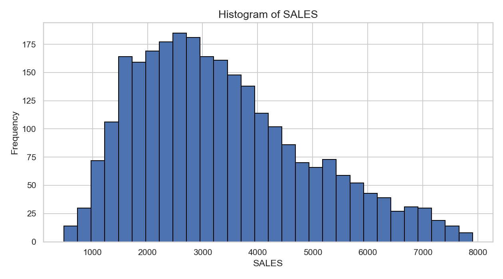
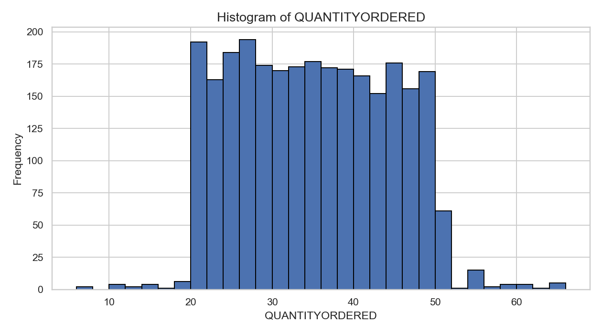
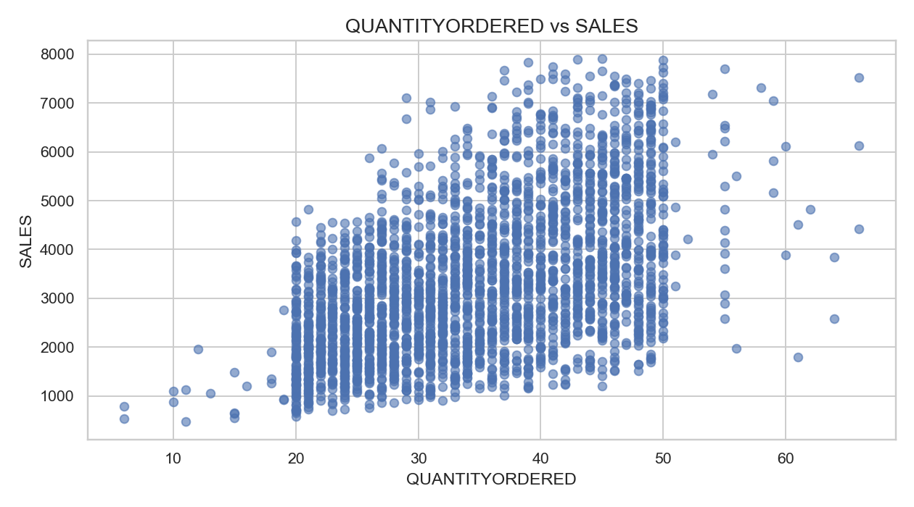
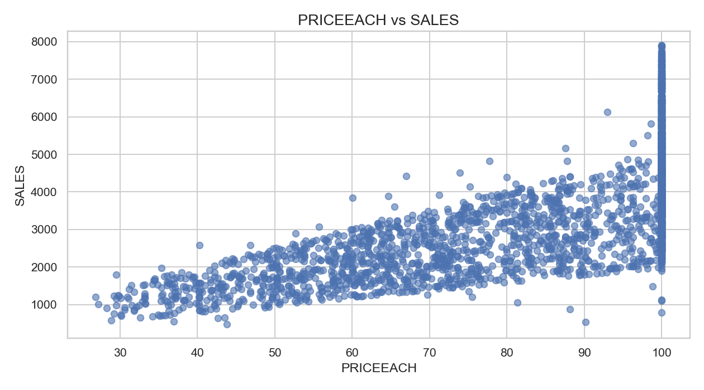
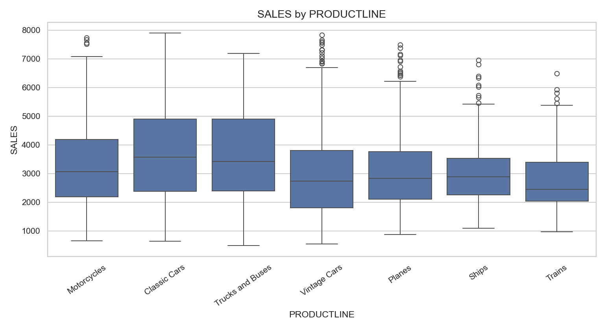
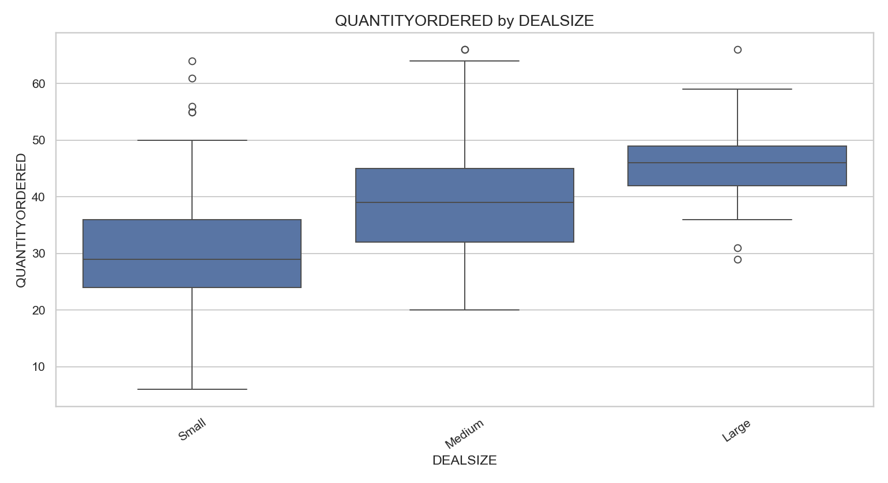
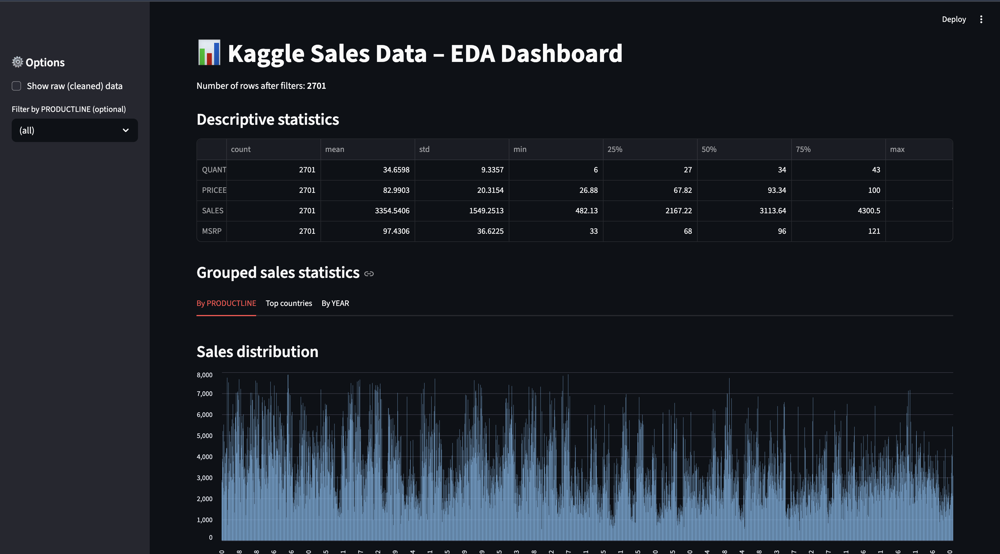

# 📊 Sales Data EDA & Regression (Kaggle Sample Sales Dataset)

Config-driven Exploratory Data Analysis (EDA) and regression on a real-world **sales dataset** from Kaggle, implemented as reusable Python modules (no Jupyter notebooks).

The goal of this project is to build a **clean, reproducible and extensible analytics pipeline** that:

- loads raw data from CSV using a YAML config
- cleans missing values and outliers in a deterministic way
- computes descriptive and grouped statistics and exports them to CSV/Parquet
- generates visualizations (histograms, scatter plots, boxplots)
- adds feature engineering for a regression model on `SALES`
- trains and compares several regression models (including boosting)
- exposes an interactive dashboard (Streamlit) and an HTTP prediction API (FastAPI)
- is structured like a small, installable package with basic tests

---

## 🔗 Dataset

This project uses the **Sample Sales Data** dataset from Kaggle:

> `sales_data_sample.csv` from:  
> <https://www.kaggle.com/datasets/kyanyoga/sample-sales-data>

> Note:  
> Due to Kaggle's terms, the CSV file is **not** stored in this repository.  
> Download it manually and place it in the `data/` folder (see below).

---

## 🗂 Project Structure

```text
01_sales_eda/
    ├─ data/
    │   └─ sales_data_sample.csv           # downloaded from Kaggle (gitignored)
    ├─ output/
    │   ├─ hist_sales.png                  # histogram of SALES
    │   ├─ hist_quantityordered.png        # histogram of QUANTITYORDERED
    │   ├─ scatter_quantityordered_vs_sales.png
    │   ├─ scatter_priceeach_vs_sales.png
    │   ├─ box_sales_by_productline.png
    │   ├─ box_quantityordered_by_dealsize.png
    │   ├─ dashboard.png                   # Streamlit dashboard screenshot
    │   ├─ summary/
    │   │   ├─ numeric_descriptive_stats.csv
    │   │   ├─ numeric_descriptive_stats.parquet
    │   │   ├─ sales_by_productline.csv
    │   │   ├─ sales_by_productline.parquet
    │   │   ├─ top_countries_by_sales.csv
    │   │   ├─ top_countries_by_sales.parquet
    │   │   ├─ sales_by_year.csv
    │   │   └─ sales_by_year.parquet
    │   ├─ regression/
    │   │   ├─ advanced_metrics.csv
    │   │   ├─ advanced_metrics.parquet
    │   │   └─ sales_regression_best_*.joblib
    │   └─ monitoring/
    │       ├─ psi_sales_*.json
    │       └─ sales_*.png
    ├─ config.yaml                          # config for paths, cleaning, outliers, plots
    ├─ sales_eda.py                         # EDA pipeline (cleaning + plots + summaries)
    ├─ sales_regression.py                  # regression models on SALES
    ├─ sales_monitoring.py                  # simple drift / monitoring demo (PSI on SALES)
    ├─ sales_api.py                         # FastAPI prediction service on top of best model
    ├─ streamlit_app.py                     # Streamlit dashboard for interactive analysis
    ├─ pyproject.toml                       # package metadata (installable via pip)
    ├─ tests/
    │   ├─ test_feature_engineering.py
    │   └─ test_regression_pipeline.py
    └─ README.md                            # this file
```

---

## ⚙️ Installation & Setup

### 1. Create virtual environment

```bash
python -m venv .venv
source .venv/bin/activate         # Windows: .venv\Scripts\activate
```

### 2. Install in editable mode (recommended)

```bash
pip install -e .
```

This installs the local package in editable mode and makes the modules importable as `sales_eda` and `sales_regression`.

If you prefer a simple requirements-based install, the minimal set is roughly:

```bash
pip install pandas numpy matplotlib seaborn pyyaml scikit-learn joblib pyarrow streamlit fastapi uvicorn
```

### 3. Download the dataset

1. Go to the Kaggle dataset page:  
   <https://www.kaggle.com/datasets/kyanyoga/sample-sales-data>
2. Download `sales_data_sample.csv`.
3. Create a `data/` folder in the project root (if it does not exist).
4. Move the CSV into the `data/` folder:

```text
01_sales_eda/
    data/
      sales_data_sample.csv
```

---

## ⚙️ Config-Driven Pipeline (`config.yaml`)

The pipeline is controlled by `config.yaml`. Example:

```yaml
active_dataset: sample_sales

data_path: "data/sales_data_sample.csv"
output_dir: "output"

numeric_columns:
  - QUANTITYORDERED
  - PRICEEACH
  - SALES
  - MSRP

cleaning:
  drop_columns:
    - ADDRESSLINE2
  fill_unknown_columns:
    - STATE
    - TERRITORY
  postalcode_column: POSTALCODE

outliers:
  iqr_factor: 1.5

plots:
  histograms:
    - SALES
    - QUANTITYORDERED
  scatters:
    - [QUANTITYORDERED, SALES]
    - [PRICEEACH, SALES]
  boxplots:
    - [PRODUCTLINE, SALES]
    - [DEALSIZE, QUANTITYORDERED]

datasets:
  sample_sales:
    data_path: "data/sales_data_sample.csv"
    numeric_columns:
      - QUANTITYORDERED
      - PRICEEACH
      - SALES
      - MSRP
    cleaning:
      drop_columns:
        - ADDRESSLINE2
      fill_unknown_columns:
        - STATE
        - TERRITORY
      postalcode_column: POSTALCODE
    outliers:
      iqr_factor: 1.5
    plots:
      histograms:
        - SALES
        - QUANTITYORDERED
      scatters:
        - [QUANTITYORDERED, SALES]
        - [PRICEEACH, SALES]
      boxplots:
        - [PRODUCTLINE, SALES]
        - [DEALSIZE, QUANTITYORDERED]

  retail_v2:
    data_path: "data/retail_v2.csv"
    numeric_columns:
      - QUANTITYORDERED
      - PRICEEACH
      - SALES
      - MSRP
    cleaning:
      drop_columns: []
      fill_unknown_columns: []
      postalcode_column: POSTALCODE
    outliers:
      iqr_factor: 1.5
    plots:
      histograms:
        - SALES
      scatters:
        - [QUANTITYORDERED, SALES]
      boxplots: []
```

`active_dataset` determines which dataset block (under `datasets:`) is applied on top of the top-level config.  
This makes it easy to reuse the same pipeline for multiple sales datasets with similar schema.

---

## 📊 Current Run – Dataset & Cleaning Summary

These numbers are from a real run on `sample_sales`:

- **Raw shape:** `2823` rows × `25` columns.
- After adding date features (`YEAR`, `MONTH`) and dropping `ADDRESSLINE2`:
  - **Shape before outlier removal:** `2823` rows × `26` columns.
- **Missing values before cleaning (top 4):**
  - `ADDRESSLINE2`: 2521
  - `STATE`: 1486
  - `TERRITORY`: 1074
  - `POSTALCODE`: 76
- Cleaning steps applied:
  - Dropped `ADDRESSLINE2`.
  - Filled `STATE` and `TERRITORY` with `"Unknown"`.
  - Cast `POSTALCODE` to string and filled missing with `"Unknown"`.
- **Missing values after cleaning:** all selected business columns (ORDERNUMBER, QUANTITYORDERED, YEAR, DEALSIZE, CONTACT names, TERRITORY, COUNTRY, POSTALCODE, STATE) have `0` missing.

Outlier removal with the IQR rule (`iqr_factor = 1.5`):

- `QUANTITYORDERED`: 8 rows outside `[3.00, 67.00]`.
- `PRICEEACH`: 0 rows outside `[21.86, 146.88]`.
- `SALES`: 79 rows outside `[-1222.43, 7909.52]`.
- `MSRP`: 35 rows outside `[-13.00, 203.00]`.

Because outlier removal is applied sequentially per column, the final filtered dataset has:

- **Final shape after outlier removal:** `2701` rows × `26` columns.

High-level numeric stats (after cleaning/outlier removal):

- `QUANTITYORDERED`: mean ≈ `34.66`, 75% ≈ `43.0`, max = `66.0`.
- `PRICEEACH`: mean ≈ `82.99`, 75% ≈ `100.0`, max = `100.0`.
- `SALES`: mean ≈ `3354.54`, 75% ≈ `4300.5`, max = `7901.1`.
- `MSRP`: mean ≈ `97.43`, 75% ≈ `121.0`, max = `194.0`.

The full numeric descriptive stats are stored in:

```text
output/summary/numeric_descriptive_stats.csv
output/summary/numeric_descriptive_stats.parquet
```

---

## ▶️ Running the EDA Script

From the project root:

```bash
python sales_eda.py
```

or, if installed as a package with entry points:

```bash
sales-eda
```

The script will:

1. Read `config.yaml` and pick the `active_dataset`.
2. Load `data_path` from config.
3. Parse the `ORDERDATE` column and create:
   - `YEAR`
   - `MONTH`
4. Clean missing values:
   - Drop columns listed in `cleaning.drop_columns` (for this dataset: `ADDRESSLINE2`).
   - Fill selected columns (`STATE`, `TERRITORY`) with `"Unknown"`.
   - Cast `POSTALCODE` to string and fill missing with `"Unknown"`.
5. Detect and remove outliers (IQR rule) from all `numeric_columns`:
   - `QUANTITYORDERED`
   - `PRICEEACH`
   - `SALES`
   - `MSRP`
6. Compute descriptive statistics for numeric columns and export them to:
   - `output/summary/numeric_descriptive_stats.csv`
   - `output/summary/numeric_descriptive_stats.parquet`
7. Compute grouped statistics and export to CSV/Parquet:
   - Sales by `PRODUCTLINE` → `sales_by_productline.*`
   - Top 10 `COUNTRY` by total sales → `top_countries_by_sales.*`
   - Sales by `YEAR` → `sales_by_year.*`
8. Generate and save plots into the `output/` folder according to the `plots` section in config.

Console output includes `[INFO]`, `[CLEAN]`, `[OUTLIERS]`, `[SUMMARY]`, and `[PLOT]` messages to show exactly what the pipeline is doing.

---

## 📈 Visual Explorations

All visualizations are generated by `sales_eda.py` and saved into `output/`.

### 1. Histograms

Overall distribution of numeric variables:

#### Histogram – `SALES`



#### Histogram – `QUANTITYORDERED`



---

### 2. Scatter Plots

Relationship between key numeric variables:

#### `QUANTITYORDERED` vs `SALES`



The script also prints the Pearson correlation between these two variables.

#### `PRICEEACH` vs `SALES`



Again, the script prints the correlation value, which can hint at:

- whether higher-priced products tend to generate higher sales amounts
- or if there is a more complex relationship.

---

### 3. Boxplots

Distribution of sales across categories:

#### Sales by Product Line



Focused view of:

- median sales per order for each product line
- spread (IQR)
- potential remaining outliers

#### Quantity Ordered by Deal Size



Useful to quickly see if:

- `"Large"` deals consistently have higher quantities
- `"Small"` deals are really small, or occasionally include large orders

---

## 🧮 Data Cleaning Logic

### Missing Values

The cleaning rules are explicit and reproducible:

- Drop `ADDRESSLINE2` (mostly missing, rarely needed for sales-level analysis).
- Fill `STATE` and `TERRITORY` with `"Unknown"` to preserve rows.
- Treat `POSTALCODE` as a string and fill missing with `"Unknown"`.

Before/after missing value counts are printed in the console.

### Outliers (IQR Rule)

For each numeric column in:

- `QUANTITYORDERED`
- `PRICEEACH`
- `SALES`
- `MSRP`

we:

1. Compute:
   - Q1 (25th percentile)
   - Q3 (75th percentile)
   - IQR = Q3 − Q1
2. Compute bounds:
   - `lower = Q1 − 1.5 * IQR`
   - `upper = Q3 + 1.5 * IQR`
3. Remove rows where the value is outside `[lower, upper]`.

For each column, the script prints:

- how many outliers were detected,
- dataset size before and after removal.

This makes the cleaning process transparent and easy to adjust later (for example, setting `iqr_factor = 3.0` in `config.yaml` for a more conservative approach).

---

## 🔢 Regression on SALES

The script `sales_regression.py` builds regression models on the cleaned data to predict `SALES`.

### 1. Feature Engineering

After the EDA cleaning pipeline, the regression module adds:

- Time-based features (from `ORDERDATE`):
  - `YEAR`
  - `MONTH`
  - `QUARTER` (1–4)
  - `SEASON` (one of `"winter"`, `"spring"`, `"summer"`, `"autumn"`)

- Numeric ratio / derived features (avoiding target leakage):
  - `PRICE_TO_MSRP_RATIO = PRICEEACH / MSRP`  
    (with infinities and NaNs handled gracefully)
  - `LINE_TOTAL_APPROX = QUANTITYORDERED * PRICEEACH`  
    (approximate line total from input features only)

- Categorical encoding:
  - `PRODUCTLINE`
  - `DEALSIZE`
  - `COUNTRY`
  - `SEASON`

A `ColumnTransformer` is used to combine:

- `StandardScaler` for numeric features
- `OneHotEncoder(handle_unknown="ignore")` for categorical features

On the cleaned sales dataset used above, the regression pipeline logged:

- `Number of samples after cleaning: 2701`
- Numeric features used:

  ```text
  ['QUANTITYORDERED', 'PRICEEACH', 'MSRP', 'YEAR', 'MONTH',
   'QUARTER', 'PRICE_TO_MSRP_RATIO', 'LINE_TOTAL_APPROX']
  ```

- Categorical features used:

  ```text
  ['PRODUCTLINE', 'DEALSIZE', 'COUNTRY', 'SEASON']
  ```

### 2. Models

The following models are trained and evaluated:

1. `LinearRegression_baseline`  
   - Pipeline: preprocessing → `LinearRegression`.

2. `RandomForest_baseline`  
   - Pipeline: preprocessing → `RandomForestRegressor` with reasonable defaults.

3. `GradientBoosting_baseline`  
   - Pipeline: preprocessing → `GradientBoostingRegressor`  
     (a boosting model that typically performs well on tabular data).

4. `RandomForest_tuned` (RandomizedSearchCV)  
   - Pipeline: preprocessing → `RandomForestRegressor`.
   - Hyperparameter search with `RandomizedSearchCV` over:
     - `n_estimators`
     - `max_depth`
     - `min_samples_split`
     - `min_samples_leaf`
     - `max_features`
   - `cv=3`, `n_iter=15`, scoring on negative RMSE.

### 3. Metrics and Persistence (Current Run)

For a concrete run on `sample_sales`, the pipeline reported the following **test-set** metrics:

| Model                     | MSE        | RMSE    | MAE     | R²    |
|---------------------------|------------|---------|---------|-------|
| LinearRegression_baseline | 233263.80  | 482.97  | 340.78  | 0.903 |
| RandomForest_baseline     | 134122.17  | 366.23  | 188.66  | 0.944 |
| GradientBoosting_baseline | 126395.65  | 355.52  | 201.49  | 0.947 |
| RandomForest_tuned        | 137114.12  | 370.29  | 190.44  | 0.943 |

On this dataset:

- `GradientBoosting_baseline` achieved the **lowest MSE/RMSE** and highest R²,  
  so it was selected as the best model.
- `RandomForest_tuned` did not beat the GradientBoosting model, which is realistic:  
  sometimes a well-parameterized boosting model on a tabular dataset wins over a tuned forest.

The best model is saved as:

```text
output/regression/sales_regression_best_GradientBoosting_baseline.joblib
```

All metrics for all models are stored in:

```text
output/regression/advanced_metrics.csv
output/regression/advanced_metrics.parquet
```

Run regression training:

```bash
python sales_regression.py
# or
sales-regression
```

---

## 📺 Streamlit Dashboard

`streamlit_app.py` provides a lightweight interactive interface on top of the EDA pipeline.

Run the dashboard:

```bash
python -m streamlit run streamlit_app.py
```

The dashboard typically includes:

- summary stats for numeric columns
- top product lines and countries by sales
- basic plots (for example SALES distribution, sales by year)
- optional filters (for example by `PRODUCTLINE`)

Screenshot example:



This is useful to demonstrate how the same data pipeline can power both scripts and a simple analytics UI.

---

## 🔍 Monitoring / Drift Detection

`sales_monitoring.py` is a small script that demonstrates a basic drift detection idea:

- uses the same cleaned dataset from the EDA pipeline
- splits the data into two periods:
  - either earliest `YEAR` vs latest `YEAR`
  - or the first half vs the second half of the dataset (fallback)
- computes a simple Population Stability Index (PSI) for the `SALES` distribution
- saves:
  - a JSON report under `output/monitoring/psi_sales_*.json`
  - a comparison histogram under `output/monitoring/sales_*.png`

Run:

```bash
python sales_monitoring.py
```

This is not production-grade monitoring, but it shows you understand the concept of tracking distribution shifts over time and could extend it in a real system.

---

## 🌐 FastAPI Prediction API

`sales_api.py` exposes a small HTTP prediction service on top of the best regression model.

### Run the API

First ensure a best model exists:

```bash
python sales_regression.py
```

Then start the server:

```bash
uvicorn sales_api:app --reload
```

Open the interactive documentation (Swagger UI) at:

- <http://127.0.0.1:8000/docs>

### Example request

`POST /predict` with JSON body:

```json
{
  "QUANTITYORDERED": 30,
  "PRICEEACH": 95.7,
  "MSRP": 110.0,
  "ORDERDATE": "2004-11-05",
  "PRODUCTLINE": "Classic Cars",
  "DEALSIZE": "Medium",
  "COUNTRY": "USA"
}
```

Example response:

```json
{
  "prediction": 5432.10,
  "currency": "USD",
  "model_name": "RandomForestRegressor",
  "model_path": "output/regression/sales_regression_best_RandomForest_tuned.joblib"
}
```

The API reuses the same feature engineering as the training pipeline  
(`add_date_features` + `create_regression_features`), so serving and training are consistent.

---

## ✅ Testing

Basic tests are included under `tests/`:

- `tests/test_feature_engineering.py`
  - runs the EDA cleaning pipeline on a subset of data
  - checks that key engineered features (`QUARTER`, `SEASON`, `PRICE_TO_MSRP_RATIO`, `LINE_TOTAL_APPROX`) exist
  - verifies they are correctly registered as numeric or categorical features

- `tests/test_regression_pipeline.py`
  - builds a limited regression dataset (for example 300 rows)
  - runs the full regression training function
  - checks that metrics are produced for all models
  - ensures RMSE values are positive and non-empty

Run all tests:

```bash
python -m pytest
```

These tests are intentionally small but show that the ML pipeline is treated as real software, with regression-safe refactors.

---

## 🔍 Example Insights

After running the EDA and regression pipeline, you can:

- Inspect descriptive statistics to understand:
  - typical order quantities
  - typical price ranges and MSRP
  - spread and skew of sales
- Use grouped statistics to answer questions like:
  - Which `PRODUCTLINE` contributes most to total sales?
  - Which countries are the top revenue drivers?
  - How total sales evolve across years?
- Use the regression models to:
  - estimate expected sales for a given combination of price, quantity and product line
  - discuss which features the model relies on (for example income proxies, price vs MSRP, product mix)
- Use the monitoring script as a starting point for:
  - tracking how the `SALES` distribution drifts over time
  - reasoning about when to retrain the model in a production setup

---

## 📜 License

```text
MIT License

Copyright (c) 2025 Mohammad Eslamnia
...
```
